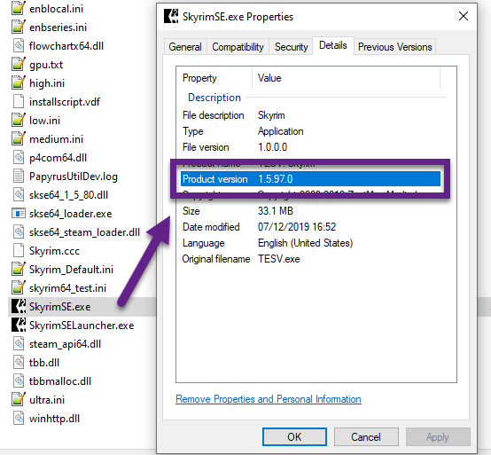
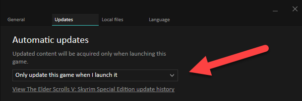

**TABLE OF CONTENTS**
- [1.1 Requirements](#11-requirements)
- [1.2 Show File Extensions](#12-show-file-extensions)
- [1.3 Your Modding Folder](#13-your-modding-folder)
  - [1.3.1 Main Directory](#131-main-directory)
  - [1.3.2 Mod Archive](#132-mod-archive)
- [1.4 Monitor Calibration](#14-monitor-calibration)
  - [1.4.1 Gamma and Brightness](#141-gamma-and-brightness)
  - [1.4.2 Dynamic Range](#142-dynamic-range)
- [1.5 Further Instructions](#15-further-instructions)
  - [1.5.1 Rules](#151-rules)
- [1.5.2 Terminology](#152-terminology)
- [2.1 Recommended Directory](#21-recommended-directory)
- [2.2 Uninstall Skyrim SE](#22-uninstall-skyrim-se)
- [2.3 New Steam Library](#23-new-steam-library)
- [2.4 Reinstallation](#24-reinstallation)
- [2.5 Version Number](#25-version-number)
  - [2.5.1 How to check version number](#251-how-to-check-version-number)
- [2.6 Disable Auto Updates](#26-disable-auto-updates)
- [2.7 Binaries Backup](#27-binaries-backup)
- [2.8 Disable Steam Overlay](#28-disable-steam-overlay)

# 01 // Getting Started

## 1.1 Requirements

- [Skyrim Special Edition](https://store.steampowered.com/app/489830/The_Elder_Scrolls_V_Skyrim_Special_Edition/) on Steam.
- A legit Windows 7 / 8 / 8.1 / 10 installation (64bit).
- The editing software [Notepad++](https://notepad-plus-plus.org/) (freeware).
- An archiving tool like [7zip](https://www.7-zip.org/download.html) or [WinRAR](https://www.win-rar.com/start.html?&L=0).
- Latest drivers for your GPU ([NVIDIA](https://www.nvidia.de/Download/index.aspx) or [AMD](https://www.amd.com/en/support)).
- A free (or Premium) account on [Nexus Mods](https://www.nexusmods.com/).

> With a **Nexus Premium** subscription you will be able to complete the guide in significantly less time since you will benefit from the uncapped download speeds (which obviously depend on your internet connection as well). A one month subscription costs £2.99, giving you more than enough time to complete the guide.

## 1.2 Show File Extensions

By default file extensions (such as EXE, PNG or ESP) are hidden in the Windows Explorer. Since it's fairly important to be able to see them during the installation of the guide, I recommend double-checking that you have them set to visible.

- Open the Windows Explorer.
- Click the **View** tab at the top.
- Make sure **File name extensions** is checked.

## 1.3 Your Modding Folder

In order to keep all files related to modding Skyrim SE in one place, we will create a dedicated directory. It will serve as a hub for all tools, downloaded mod archives, custom files, notes, backups, screenshots and whatever else you can think of.

Throughout the guide I will refer to this folder as **Your Modding Folder**.

### 1.3.1 Main Directory

- Create a new folder anywhere on an HDD with at least 200GB of free space. Don't waste SSD space on this.
- Name it whatever you like, for example **Skyrim SE Modding**.
- Add several more new folders inside as shown below:

### 1.3.2 Mod Archive

Proper organisation is key when modding Skyrim. You will come back many times to update or reinstall mods, or selectively extract files without installing the whole package. This is where the previously created **ARCHIVE** comes into play - it will contain the majority of downloaded mod archives.

- Create several more folders inside the **ARCHIVE** folder:

## 1.4 Monitor Calibration

### 1.4.1 Gamma and Brightness

Assuming you already have your monitor configured with your preferred settings for resolution and refresh rate (in my case that is 60Hz and 1920x1080), you might still want to adjust the brightness and / or gamma either through your graphics card control panel or Windows' inbuilt calibration tool.

> Your monitor should have been running for at least 30 minutes before you adjust it.

- **WINDOWS:** Control Panel > Colour Management > Advanced > Calibrate display
- **NVIDIA:** Control Panel > NVIDIA Control Panel > Adjust Desktop Color Settings
- **AMD:** Unfortunately I do not own an AMD GPU and never have so I cannot give advice here. Use the inbuilt Windows calibration tool.

To help you find the sweet spot for your monitor, check out these resources:

- [CLF ENB - monitor calibration help](https://i.imgur.com/k1v8p1M.png)
- [Photo Friday Monitor Calibration Tool](https://www.photofriday.com/info/calibrate)
- [Lagom: LCD monitor test images](http://www.lagom.nl/lcd-test/)

### 1.4.2 Dynamic Range

It is recommended that you ensure your monitor's **Dynamic Range** to "Full" if it is connected to your PC via DisplayPort or HDMI. Instructions for both NVIDIA and AMD based systems can be found [here](https://pcmonitors.info/articles/correcting-hdmi-colour-on-nvidia-and-amd-gpus/).

It turns out I actually had my monitor set to "Limited" for many years and grew so used to it that setting the Dynamic Range to "Full" only irritated me. Eventually I set it back to "Limited" with no regrets. Your mileage may vary.

## 1.5 Further Instructions

### 1.5.1 Rules

Before we finally jump into the actual guide, here are some critical pieces of information that I urge you to read **carefully** before  continuing:

- **Which parts are required?** All instructions and mods are mandatory unless they are clearly marked otherwise. A large portion of mods is marked as(optional) and you may safely skip them. **Do not skip required mods**. There are instructions for all mods with FOMOD installers and you are expected to follow them.

- **About additional mods:** Please wait until **after** you finished and tested your setup before adding more mods. Otherwise you will no longer be eligible to receive support on our Discord should you need it. We do not offer support for setups that are not 100% TPF.

## 1.5.2 Terminology

The difference between these folders is significant. Do not confuse them.

| Name            | File Path                                             | Content                  |
| --------------- | ----------------------------------------------------- | ------------------------ |
| **root folder** | `Steam/steamapps/common/Skyrim Special Edition/`      | contains the executables |
| **data folder** | `Steam/steamapps/common/Skyrim Special Edition/Data/` | contains the game files  |

---

# 02 // Skyrim SE

## 2.1 Recommended Directory

The entire point of reinstalling Skyrim SE is not only to make sure you have a clean, vanilla setup but also to be able to control where the game is installed on your drive. Here is what you need to keep in mind:

- **Avoid UAC protected folders.** UAC protected folders and their contents have higher security standards than other folders which can cause all kinds of issues for modding tools. To prevent any such issues from occuring in the future, never install any modding tools or the game under `C:\Program Files` or `C:\Program Files x86`.

- **Further considerations:** While it is highly recommend to install the modded game on an SSD for faster loading screens and potential decrease or elimination of stuttering, be aware that a large amount of free space is required. This is because  Skyrim SE and Mod Organizer 2 should be installed on the same drive. While the Skyrim SE base installation reaches around 12.5GB, your MO2 directory will eventually grow well beyond 50GB in size, depending on the amount and types of mods you add. If you can spare 100GB or more of SSD space, it is highly recommended you do so.

> Installing Skyrim SE or any related tools in an UAC protected folder will disqualify from getting support on our Discord server.

## 2.2 Uninstall Skyrim SE

**Skip this step if you do not have Skyrim SE installed.**

- Open Steam and go to your **Library**.
- Find **The Elder Scrolls V: Skyrim Special Edition** in the list.
- Right-click it and select **Uninstall**.
- Wait for the process to complete before you continue.

## 2.3 New Steam Library

For the purpose of the guide - in order to prevent confusion - I will refer to the Library in Steam as the **Game Library**. It is the second of four items in the top menu in Steam and contains a list of all your games.

A **Steam Library** on the other hand is a directory on your hard drive into which your Steam games are installed. By default this would be `C:\Program Files x86\Steam\steamapps\common\`. Since we do not want to have files inside an UAC protected folder like Program Files x86, we should not install Skyrim SE in the default directory. A new **Steam Library** is required.

> It is important to note that Steam only allows one **Steam Library** per hard drive, although there is a workaround. If for instance you already have a **Steam Library** on your C:\ drive, but you want to have your modding files on the same drive, you need to create a new **Steam Library** manually following the instructions [here](https://steamcommunity.com/discussions/forum/1/135511294066324002).

If you already have a separate Steam Library outside the UAC protected folders on the drive you want to install Skyrim SE and Mod Organizer 2 on, skip ahead to section 2.4. Otherwise follow the instructions below to create a new **Steam Library**:

* Open Steam and go into the **Settings**.
* In the **Downloads** tab, select **Steam Library Folders**.
* Click **Add Library Folder**.
* Point it to a location somewhere outside the UAC protected folders.
  * For example: `G:\Steam Library\`
* Close all windows when you’re done.

## 2.4 Reinstallation

* Open Steam and go into your **Game Library**.
* Find **The Elder Scrolls V: Skyrim Special Edition** in the list and click **Install**.
* As location, select the Steam Library you just created.
* Wait for Skyrim SE to be downloaded and installed.

## 2.5 Version Number

Because the Script Extender and certain other mods are version dependent, you must run a specific version of Skyrim SE. That is typically the latest version unless there was an update recently and the community hasn't caught up yet in which case you need to roll back.

The currently supported version of Skyrim SE is: **1.5.97**.

> If you accidentally updated to a newer version, please refer to **[this guide here](https://www.nexusmods.com/skyrimspecialedition/mods/19658)** in order to roll back.

### 2.5.1 How to check version number

* Navigate to your **root** folder.
* Right-click **SkyrimSE.exe** and select **Properties**.
* Switch to the **Details** tab and check under **Product version**.

## 2.6 Disable Auto Updates

When Skyrim SE receives another update – which happens regularly because of the Creation Club – SKSE64 and all SKSE plugins will need to be updated as well. This usually takes around a week at least.

However you can continue playing the previous version with SKSE64 and all your mods by simply setting Skyrim SE to only update when launching the game – since you start the game through the SKSE64 launcher, Steam will never update.

* Open Steam and find **The Elder Scrolls V: Skyrim Special Edition** in your **Game Library**.
* Right-click it, select **Properties** and switch to the **Updates** tab.
* Make sure **Automatic updates** is set to **Only update this game when I launch it**.
* Problem solved!

## 2.7 Binaries Backup

Although Steam will no longer update Skyrim SE automatically, I still recommend keeping backups of the two executables (**SkyrimSE.exe** and **SkyrimSELauncher.exe**), just in case. If you accidentally updated, all you need to do to roll back is replace the executables in your **root** folder with the ones you backed up. This also comes in handy if you had to regenerate INI files or validate game files through Steam for whatever reason and were forced to update.

* Create a new folder: `Your Modding Folder\Backups\Skyrim SE 1.x.x` (enter the current version number).
* Copy the following two files from your **root** folder into the new directory:
  * **SkyrimSE.exe**
  * **SkyrimSELauncher.exe**

## 2.8 Disable Steam Overlay

**This step is optional.**

While I’ve personally never had any issues with the Steam Overlay in modded Skyrim SE, that seems to be an exception and it is indeed common practice to disable it as a precaution. Note that we will only disable it for Skyrim SE. The overlay will still work as usual for all other games.

Since disabling the Steam Overlay will also prevent you from taking screenshots with Steam, I keep it enabled – as mentioned, without problems so far.

* Once again, open Steam.
* Find **The Elder Scrolls V: Skyrim Special Edition** in your Library.
* Right-click it and select **Properties**.
* Uncheck **Enable the Steam Overlay while in-game**.
* Close the window.